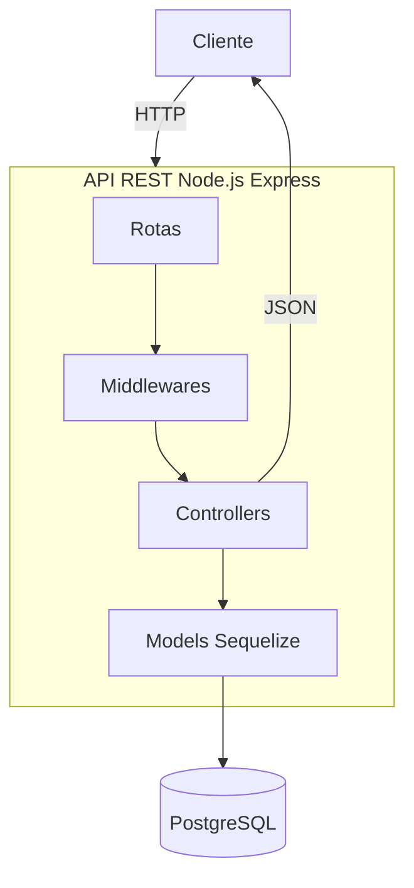

# API Drive Easy: Sistema de Gerenciamento Inteligente para Locadoras de Veículos (Node.js/Express)

[](https://nodejs.org/)
[](https://expressjs.com/)
[](https://sequelize.org/)
[](https://www.postgresql.org/)
[](https://opensource.org/licenses/ISC)
---

## Instituições de Fomento e Parceria

[](https://www.ifb.edu.br/) 
[](https://hardware.org.br/)

## Orientador 
[](https://www.linkedin.com/in/tiagosegato/)
[-%23181717.svg?logo=github&logoColor=white)](https://github.com/tiagosegato)
[](http://lattes.cnpq.br/3802976697073676)


---

## Sumário

- [Visão Geral](#visão-geral)
- [Pacotes Utilizados](#pacotes-utilizados)
- [Estrutura do Projeto](#estrutura-do-projeto)
- [Diagrama de Banco de Dados](#diagrama-de-banco-de-dados)
- [Diagrama de Arquitetura do Sistema](#diagrama-de-arquitetura-do-sistema)
- [Documentação da API](#documentação-da-api)
- [Configuração do Ambiente](#configuração-do-ambiente)
---

## Visão Geral

A **API Drive Easy** é um sistema RESTful desenvolvido para gerenciar todas as operações essenciais de uma locadora de veículos. O objetivo principal é automatizar o fluxo de trabalho, desde o cadastro de carros e usuários até o registro e cálculo inteligente das locações.

**Domínio de Aplicação:** Gestão de Locação de Veículos.
**Público-Alvo:** Clientes (consulta de locações) e Funcionários/Administradores (gestão completa do sistema).

**Funcionalidades de Alto Nível:**
* **Controle de Acesso:** Autenticação JWT e autorização baseada em perfil (`Cliente` vs. `Funcionário`).
* **Cálculo Automático de Locação:** O sistema calcula o valor total da locação dinamicamente com base na diária do carro e no período de aluguel.
* **Gestão de Estoque:** Atualização automática do status do carro (`Disponível` / `Alugado`).
* **Segurança de Dados:** Clientes só podem visualizar suas próprias locações.

---

## Pacotes Utilizados

Lista das dependências Node.js/Express utilizadas no projeto.

| Pacote | Versão | Descrição |
| :--- | :--- | :--- |
| **express** | `^5.2.1` | Framework web principal para roteamento e middlewares. |
| **sequelize** | `^6.37.7` | ORM para mapeamento objeto-relacional. |
| **jsonwebtoken** | `^9.0.3` | Geração e verificação de tokens JWT. |
| **bcryptjs** | `^3.0.3` | Criptografia (hashing) de senhas. |
| **dotenv** | `^17.2.3` | Gerenciamento de variáveis de ambiente (`.env`). |
| **pg** | `^8.16.3` | Driver PostgreSQL. |
| **pg-hstore** | `^2.3.4` | Suporte a tipos de dados HSTORE para PostgreSQL. |
| **bcrypt** | `^6.0.0` | Utilitário para hashing criptográfico. |
| **nodemon** | `^3.1.11` | (DEV) Reinicia o servidor automaticamente durante o desenvolvimento. |
| **sequelize-cli** | `^6.6.3` | (DEV) Interface de Linha de Comando do Sequelize para Migrations e Seeders. |

---

## Estrutura do Projeto

A arquitetura segue o padrão **MVC (Model-View-Controller)** com pastas claras para cada componente.

```
sistema-aluguel-carros/
├── config
│   └── config.js
├── controllers/
│   ├── autenticacaoController.js
│   ├── carroController.js
│   ├── locacaoController.js
│   └── usuarioController.js
├── middleware/
│   ├── autenticacao.js
│   └── autorizacao.js
├── migrations/
│   ├── 20251210204431-create-usuario.js
│   ├── 20251210205000-create-carro.js
│   ├── 20251210210149-create-locacao.js
│   └── 20251210235959-add-valor-diaria-to-carros.js
├── models/
│   ├── carro.js
│   ├── index.js
│   ├── locacao.js
│   └── usuario.js
├── node_modules/
│   └── (...)
├── routes/
│   ├── carroRoutes.js
│   ├── locacaoRoutes.js
│   ├── publicRoutes.js
│   └── usuarioRoutes.js
├── seeders/
│   ├── 20251215213706-add-initial-users.js
│   ├── 20251215220714-add-initial-cars.js
│   └── 20251215225939-add-initial-locacoes.js
├── .env
├── .gitignore
├── app.js
├── package-lock.json
├── package.json
└── README.MD
```


---

## Diagrama de Banco de Dados


### Principais Entidades e Relacionamentos
* **Usuário**: Entidade central diferenciada pelo campo `tipo` (Cliente ou Funcionário). Possui campos críticos para identificação e conformidade legal, como `id` e `cnh`.
* **Carro**: Representa os veículos da frota. Controla a disponibilidade via campo `status` e define a base de cálculo financeira através do `valor_diario`.
* **Locação**: Entidade de ligação que formaliza o aluguel. Relaciona-se com:
    * **Carro** (1:N): Uma locação contém um carro específico.
    * **Funcionário** (1:N): Identifica o responsável por registrar a operação.
    * **Cliente** (1:N): Identifica o locatário que realizou o aluguel.
    * **Campos Críticos**: As datas de `inicio`/`fim` e o `valor` total calculado são os dados vitais desta entidade.
---
## Diagrama de Arquitetura do Sistema 

---
## Documentação da API

A API utiliza o formato JSON para envio e recebimento de dados. Rotas protegidas exigem o envio do Token JWT no cabeçalho `Authorization` como `Bearer [token]`.

### 1. Rotas Públicas (Autenticação e Registro)
Lida com o acesso inicial ao sistema.

| Método | Endpoint    | Descrição                          | Autenticação |
| :----- | :---------- | :--------------------------------- | :----------- |
| `POST` | `/cadastro` | Realiza o cadastro de novos clientes. | Pública      |
| `POST` | `/login`    | Autentica usuário e retorna o JWT. | Pública      |

---

### 2. Gestão de Usuários
Acessos administrativos para controle de contas. É importante destacar que essas rotas possuem prefixos específicos.

| Método   | Endpoint                 | Descrição                            | Permissão     |
| :------- | :----------------------- | :----------------------------------- | :------------ |
| `GET`    | `/listar/usuarios`       | Lista todos os usuários cadastrados. | Funcionário   |
| `GET`    | `/buscar/:id`            | Busca detalhes de um usuário por ID. | Funcionário   |
| `PUT`    | `/atualizar/:id`         | Atualiza dados de um usuário.        | Funcionário   |
| `DELETE` | `/deletar/:id`           | Remove um usuário do sistema.        | Funcionário   |

---

### 3. Gestão de Carros (Frota)
Gerenciamento de veículos disponíveis para locação.

| Método   | Endpoint       | Descrição                           | Permissão     |
| :------- | :------------- | :---------------------------------- | :------------ |
| `POST`   | `/carros`      | Cadastra um novo veículo na frota.  | Funcionário   |
| `GET`    | `/carros`      | Lista todos os carros cadastrados.  | Funcionário   |
| `GET`    | `/carros/:id`  | Detalhes de um carro específico.    | Funcionário   |
| `PUT`    | `/carros/:id`  | Atualiza informações do veículo.    | Funcionário   |
| `DELETE` | `/carros/:id`  | Remove um veículo da frota.         | Funcionário   |

---

### 4. Locações
Operações de registro de aluguéis e consultas de histórico.

| Método   | Endpoint                    | Descrição                                 | Permissão     |
| :------- | :-------------------------- | :---------------------------------------- | :------------ |
| `GET`    | `/locacoes/consultarCliente`| Lista as locações do próprio cliente logado. | Autenticado  |
| `POST`   | `/locacoes`                 | Registra uma nova locação de veículo.     | Funcionário   |
| `GET`    | `/locacoes`                 | Lista todas as locações do sistema.       | Funcionário   |
| `GET`    | `/locacoes/:id`             | Busca detalhes de uma locação por ID.     | Funcionário   |
| `PUT`    | `/locacoes/:id`             | Atualiza dados de uma locação.            | Funcionário   |
| `DELETE` | `/locacoes/:id`             | Deleta um registro de locação.            | Funcionário   |

---

### Observações Técnicas:
* **Middlewares:**
    * `autenticar`: Verifica se o token JWT é válido e identifica o usuário.
    * `eFuncionario`: Bloqueia o acesso caso o usuário autenticado não seja do tipo "Funcionario".
* **Regras de Negócio:**
    * A rota `/locacoes/consultarCliente` filtra automaticamente os resultados para que um cliente nunca veja os dados de outro.
---
## Configuração do Ambiente

Siga os passos abaixo para configurar o ambiente local.

1. **Clone o repositório:**
   ```bash
   git clone https://github.com/EsterAlvex/sistema-aluguel-carros.git
   cd sistema-aluguel-carros
   ```

2. **Instale as dependências:**
   ```bash
   npm install
   ```

3. **Configure as variáveis de ambiente:**
   ```bash
   Crie um arquivo .env com as credenciais do seu banco de dados, a chave JWT_SECRET e a CHAVE_ADMIN para realizar o cadastro de funcionário.
   Exemplo do arquivo .env:
   DB_HOST=localhost
   DB_PORT=5432
   DB_USER=seu_usuario_postgres
   DB_PASSWORD=sua_senha_postgres
   DB_NAME=nome_do_seu_banco
   PORT=3000
   JWT_SECRET=uma_chave_segura_para_o_token
   CHAVE_ADMIN=sua_chave_de_cadastro_para_funcionarios
   ```

4. **Aplique as migrações e inicie o servidor:**
   ```bash
   npx sequelize-cli db:migrate
   npm start
   ```
5. **Para usar o seeders aplique este comando:**
 ```bash
   npx sequelize-cli db:seed:all
   ```
6. **Inicie o servidor:**
   ```bash
   npm start
   ```
---
